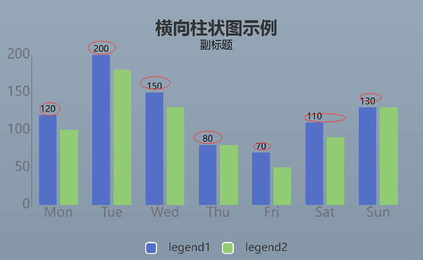

# Echarts配置项

## Option : object

#### [title](https://echarts.apache.org/zh/option.html#title): 标题组件 对象

- id :  字符串. 组件 ID。默认不指定。指定则可用于在 option 或者 API 中引用组件。

- show:  布尔值.  是否显示标题组件。

- text : 字符串. 主标题文本，支持使用 `\n` 换行。

- link: 字符串. 主标题文本超链接。

- target :字符串. 指定窗口打开主标题超链接, 可选:

  -   `'self'` 当前窗口打开
  - `'blank'` 新窗口打开。

- textStyle: 对象. 

  - color 主标题文字的颜色   "#333"

  - fontStyle 主标题文字字体风格

    - `'normal'`
    - `'italic'`    斜体
    - `'oblique' `   斜体

  - fontWeight  字符串/数值 主标题文字字体粗细

    - `'normal'`
    - `'bold'`
    - `'bolder'`
    - `'lighter'`
    - 100 | 200 | 300 | 400...

  - fontFamily  字符串. 主标题文字字体系列

  - fontSize  数值/字符串+px. 主标题文字字体系列

  - lineHeight 数值. 行高.  

    - ```js
      rich` 中如果没有设置 `lineHeight`，则会取父层级的 `lineHeight
      例如:
      {
          lineHeight: 56,
          rich: {
              a: {
                  // 没有设置 `lineHeight`，则 `lineHeight` 为 56
              }
          }
      }
      ```

  - width 数值. 文本显示宽度。

  - height 数值. 文本显示高度。

  - textBorderColor  #/rgb 文字本身的描边颜色。

  - textBorderWidth 数值. 文字本身的描边宽度。

  - textBorderType 字符串/数值/数组. 文字本身的描边类型。

    - `'solid'`

    - `'dashed'`

    - `'dotted'`

    - 自 `v5.0.0` 开始，也可以是 `number` 或者 `number` 数组，用以指定线条的 [dash array](https://developer.mozilla.org/zh-CN/docs/Web/SVG/Attribute/stroke-dasharray)，配合 `textBorderDashOffset` 可实现更灵活的虚线效果。

      例如：

      ```ts
      {
      
      textBorderType: [5, 10],
      
      textBorderDashOffset: 5
      }
      
      ```

  - textBorderDashOffset 数值

    - > 从 `v5.0.0` 开始支持

      用于设置虚线的偏移量，可搭配 `textBorderType` 指定 dash array 实现灵活的虚线效果。

      更多详情可以参考 MDN [lineDashOffset](https://developer.mozilla.org/zh-CN/docs/Web/API/CanvasRenderingContext2D/lineDashOffset)。

  - textBorderDashOffset  color  文字本身的阴影颜色

  - textShadowBlur 数值. 文字本身的阴影长度。

  - textShadowOffsetX 数值 文字本身的阴影 X 偏移。

  - textShadowOffsetY 数值 文字本身的阴影 Y 偏移。

  - overflow 字符串 文字超出宽度是否截断或者换行。配置`width`时有效

    - `'truncate'` 截断，并在末尾显示`ellipsis`配置的文本，默认为`...`
    - `'break'` 换行
    - `'breakAll'` 换行，跟`'break'`不同的是，在英语等拉丁文中，`'breakAll'`还会强制单词内换行

  - ellipsis 字符串 在`overflow`配置为`'truncate'`的时候，可以通过该属性配置末尾显示的文本

  - rich 对象 在 `rich` 里面，可以自定义富文本样式。利用富文本样式，可以在标签中做出非常丰富的效果。

    - 例如：

      ```js
      label: {
          // 在文本中，可以对部分文本采用 rich 中定义样式。
          // 这里需要在文本中使用标记符号：
          // `{styleName|text content text content}` 标记样式名。
          // 注意，换行仍是使用 '\n'。
          formatter: [
              '{a|这段文本采用样式a}',
              '{b|这段文本采用样式b}这段用默认样式{x|这段用样式x}'
          ].join('\n'),
      
          rich: {
              a: {
                  color: 'red',
                  lineHeight: 10
              },
              b: {
                  backgroundColor: {
                      image: 'xxx/xxx.jpg'
                  },
                  height: 40
              },
              x: {
                  fontSize: 18,
                  fontFamily: 'Microsoft YaHei',
                  borderColor: '#449933',
                  borderRadius: 4
              },
              ...
          }
      }
      ```

      详情参见教程：[富文本标签](https://echarts.apache.org/zh/tutorial.html#富文本标签)

- subtext 字符串 副标题文本，支持使用 `\n` 换行。

  - 

- sublink 字符串 副标题文本超链接。

- subtarget 字符串 指定窗口打开副标题超链接 可选:

  - `'self'` 当前窗口打开
  - `'blank'` 新窗口打开

- subtextStyle 对象 可参考 [subtextStyle](https://echarts.apache.org/zh/option.html#title.subtextStyle) , 和textStyle差不多

- textAlign 字符串.  整体（包括 text 和 subtext）的水平对齐。可选：`'auto'`、`'left'`、`'right'`、`'center'`。

- textVerticalAlign 字符串. 整体（包括 text 和 subtext）的垂直对齐。可选值：`'auto'`、`'top'`、`'bottom'`、`'middle'`。

- triggerEvent: 布尔值, 默认false 是否触发事件

- padding: 数值/数组. 标题内边距，单位px，默认各方向内边距为5，接受数组分别设定上右下左边距。

  - 使用示例：

    ```js
    // 设置内边距为 5
    padding: 5
    // 设置上下的内边距为 5，左右的内边距为 10
    padding: [5, 10]
    // 分别设置四个方向的内边距
    padding: [
        5,  // 上
        10, // 右
        5,  // 下
        10, // 左
    ]
    ```

- itemGap 数值. 主副标题之间的间距。

- zlevel 数值.  有图形的 zlevel 值。

  - `zlevel`用于 Canvas 分层，不同`zlevel`值的图形会放置在不同的 Canvas 中，Canvas 分层是一种常见的优化手段。我们可以把一些图形变化频繁（例如有动画）的组件设置成一个单独的`zlevel`。需要注意的是过多的 Canvas 会引起内存开销的增大，在手机端上需要谨慎使用以防崩溃。

  - `zlevel` 大的 Canvas 会放在 `zlevel` 小的 Canvas 的上面。

- z 数值. 组件的所有图形的`z`值。控制图形的前后顺序。`z`值小的图形会被`z`值大的图形覆盖

  - `z`相比`zlevel`优先级更低，而且不会创建新的 Canvas。

- left 字符串/数值   title 组件离容器左侧的距离。

  - `left` 的值可以是像 `20` 这样的具体像素值，可以是像 `'20%'` 这样相对于容器高宽的百分比，也可以是 `'left'`, `'center'`, `'right'`。

    如果 `left` 的值为`'left'`, `'center'`, `'right'`，组件会根据相应的位置自动对齐。

- top 字符串/数值  title 组件离容器上侧的距离。

  - `top` 的值可以是像 `20` 这样的具体像素值，可以是像 `'20%'` 这样相对于容器高宽的百分比，也可以是 `'top'`, `'middle'`, `'bottom'`。

    如果 `top` 的值为`'top'`, `'middle'`, `'bottom'`，组件会根据相应的位置自动对齐。

- right 字符串/数值.  title 组件离容器右侧的距离。

  - `right` 的值可以是像 `20` 这样的具体像素值，可以是像 `'20%'` 这样相对于容器高宽的百分比。

    默认自适应。

- bottom 字符串/数值. title 组件离容器下侧的距离。

  - bottom 的值可以是像 `20` 这样的具体像素值，可以是像 `'20%'` 这样相对于容器高宽的百分比。

    默认自适应。

- backgroundColor  color. 标题背景色，默认透明。

  - 颜色可以使用 RGB 表示，比如 `'rgb(128, 128, 128)'` ，如果想要加上 alpha 通道，可以使用 RGBA，比如 `'rgba(128, 128, 128, 0.5)'`，也可以使用十六进制格式，比如 `'#ccc'`

- borderColor color. 标题的边框颜色。支持的颜色格式同 backgroundColor。

- borderWidth 数值. 标题的边框线宽。

- borderRadius 数值/数组. 圆角半径，单位px，支持传入数组分别指定 4 个圆角半径。

  - borderRadius: 5, *// 统一设置四个角的圆角大小* borderRadius: [5, 5, 0, 0] *//（顺时针左上，右上，右下，左下）*

- shadowBlur 数值. 图形阴影的模糊大小。该属性配合 `shadowColor`,`shadowOffsetX`, `shadowOffsetY` 一起设置图形的阴影效果。

  - {    shadowColor: 'rgba(0, 0, 0, 0.5)',    shadowBlur: 10 }
  - **注意**：此配置项生效的前提是，设置了 `show: true` 以及值不为 `tranparent` 的背景色 `backgroundColor`。

- shadowColor color 

### tooltip: 提示框组件

- object
- 内置参数: 
  - tigger :  触发方式   string
    - "axis" : 坐标轴
    - "item": 内容区
  - axisPointer: object   坐标轴触发有效的指示器,
    - type: 默认为直线 
      - "shadow" 阴影
      - line  线


### legend: 图例组件

- object

- 内置参数:
  - data: array          //series 中若有了name值则 legend中的data可以删掉
  
  - - left top bottom right  **必须设置偏移值,否则看不到位置**
  
    - itemStyle 对象, 图例的图形样式。其属性的取值为 `'inherit'` 时，表示继承系列中的属性值。
  
      - borderColor color, 图形的描边颜色。支持的颜色格式同 `color`，不支持回调函数。
  
      - borderWidth **必须指定数值**, 指定边框宽度
  
      - borderType 字符串/数值/数组, 描边类型
  
        - `'solid'`
  
        - `'dashed'`
  
        - `'dotted'`
  
        - 自 `v5.0.0` 开始，也可以是 `number` 或者 `number` 数组，用以指定线条的 [dash array](https://developer.mozilla.org/zh-CN/docs/Web/SVG/Attribute/stroke-dasharray)，配合 `borderDashOffset` 可实现更灵活的虚线效果。
  
          例如：
  
          ```js
          {
          
          borderType: [5, 10],
          
          borderDashOffset: 5
          }
          ```
  
    - itemGap 数值, **图例每项之间的间隔**。横向布局时为水平间隔，纵向布局时为纵向间隔。
    - itemWidth 数值, 图例标记的图形宽度。
    - itemHeight 数值, 图例标记的图形高度。
    - textStyle 对象, 图例的公用文本样式。
      - color
      - fontSize
      - padding 数值/数组 , 文字块的内边距, **调整文字与图例图形的距离**
  
  - lineStyle 对象, **图例图形中线的样式**，用于诸如折线图图例横线的样式设置。其属性的取值为 `'inherit'` 时，表示继承系列中的属性值。

### toolBox: 保存组件

- object

### grid:  绘图网格配置

- object
- **网格内容区为图例内容区域, 区分外层容器盒子区域, 此配置决定图例内容的大小**
- 
- 内置参数: 
  - left : string
  - right : string
  - bottom : string
  - top : string
  -  **当left,right设置为0时, 刻度标签贴近容器盒子, 隐藏或显示刻度标签使用containLabel **
  - containLabel :  boolean  
    - 是否显示刻度标签
    - 为false时, 不再保留刻度标签的位置, 只显示图例内容位置到盒子边框区域的距离

### xAxis: x轴相关配置

- object / array  若需要展示轴线上多处标签数据,则复用对象,外层改数组包裹

- 直角坐标系 grid 中的 x 轴，一般情况下单个 grid 组件最多只能放上下两个 x 轴，多于两个 x 轴需要通过配置 [offset](https://echarts.apache.org/zh/option.html#xAxis.offset) 属性防止同个位置多个 x 轴的重叠。
  - 轴对象数量需要和series对象数量一一对应
  
  - 
  
  - ```js
      xAxis: [
                {
                    type: 'category',
                    data: ['Mon', 'Tue', 'Wed', 'Thu', 'Fri', 'Sat', 'Sun'],
                    axisLabel: {
                        fontSize: 60
                    },{...},{... ,offset: 100}
                },
    ```
  
  - 
  
- 内置参数:
  - show: boolean  是否显示轴相关信息,默认ture
  - boundaryGap: false / array / number
    - 轴线底部与内容区域产生间距
  - **type: string** 
    - **"category" : 为默认值 , 可配置显示的具体内容data**
    - **"value" : 显示数据值**
  - data: array
    - 坐标轴底部坐标刻度标签数据
  - inverse: Boolean 
    - 是否是反向坐标轴
  - axisLabel: 对象, 坐标轴刻度标签的相关设置。
    - fontSize: 数值, 文字的字体大小。
  - axisLine:对象, 坐标轴轴线相关设置。
    -  show 布尔值, 是否显示坐标轴轴线。
  - offset: 数值, X 轴相对于默认位置的偏移，**在相同的 `position` 上有多个 X 轴的时候有用。**

### yAxis: y轴相关配置

-  内置参数 :

  -  nameTextStyle: {

    ​      color: '#ebf8ac',

    ​      fontSize: '50px',

    ​     }

    - 轴线末端标题设置参数

### series: 系列图表配置

- array

- 内置参数

  - 若干个对象参数,对象内自定义参数

    - name  单个对象的名字

    - type   对象的展示类型

    - stack  数据堆叠, 同类目轴配置stack相同的值,后一个系列的值会在前一个系列的值上相加,  简单点就是数据展示总量累加展示

    - data  单个对象的参数配置

    - barWidth: string    单个柱子宽度

    - itemStyle: object 

      - barBorderRadius: number  柱子边框边框圆角

      - color: string / function, 柱子的颜色, 如果给每个不同的柱子设置颜色,则需要将颜色单独声明一个数组,以函数形式引入

        - let barColor = ["#ccc" ,"#000" ]

        - color :function(params) {

           let num = barColor .length ;

          return barColor [params.dataIndex % num ]

          // params 传入的是柱子对象数据 

          // dataIndex 当前下标 一 一对应

          }

      - borderColor = string

      - borderWidth:number

    - barCategoryGap: number,  柱子之间的距离

    - label: object , **图形上的文本标签**

      - 
        - show : boolean , 是否显示标签。
        - position : 字符串/数组 ,  可以通过内置的语义声明位置
        - formatter  字符串/函数   ,标签内容格式器，支持字符串模板和回调函数两种形式，字符串模板与回调函数返回的字符串均支持用 `\n` 换行。

### color: 设置颜色

- array
- 设置配置对象的若干颜色

## 柱状图

### xAxis.aixsLabel - 修改刻度标签相关样式

- object

- 参数配置
  - color 
  - fontSize

### xAxis.aixsLine - 是否显示x坐标轴的样式

- object

- 参数配置
  - show: boolean
  - lineStyle: object   坐标轴线风格
    - color
  - width: 轴线宽度

### xAxis.splitLine - 分割线的样式

- object
- 参数配置
  - lineStyle: object

### xAxis.axisTick - 轴线刻度

- object
- 配置参数
  - show: boolean

### xAxis.aAxisIndex - 层叠顺序

- number
- 一般用于进度条框与进度条本身重叠样式

### yAxis -- 同x轴配置一样


# 让图表跟随屏幕自适应大小

- window.addEventListener("DOM元素" , function(){

  ​    //监听resize事件

  ​     实例对象.resize()

  })

### 

# 字符串模板

- 模板变量有:
  - {a} : 系列名
  - {b}: 数据名 , 即刻度条名
  - {c} : 数据值,即data值
  - {@xxx} :数据中名为‘xxx'的维度的值，如{@product}表示名为 'product”的维度的值。
  - {@[n]}:数据中维度n的值，如{@[3]}`表示维度3的值，从0开始计数。

